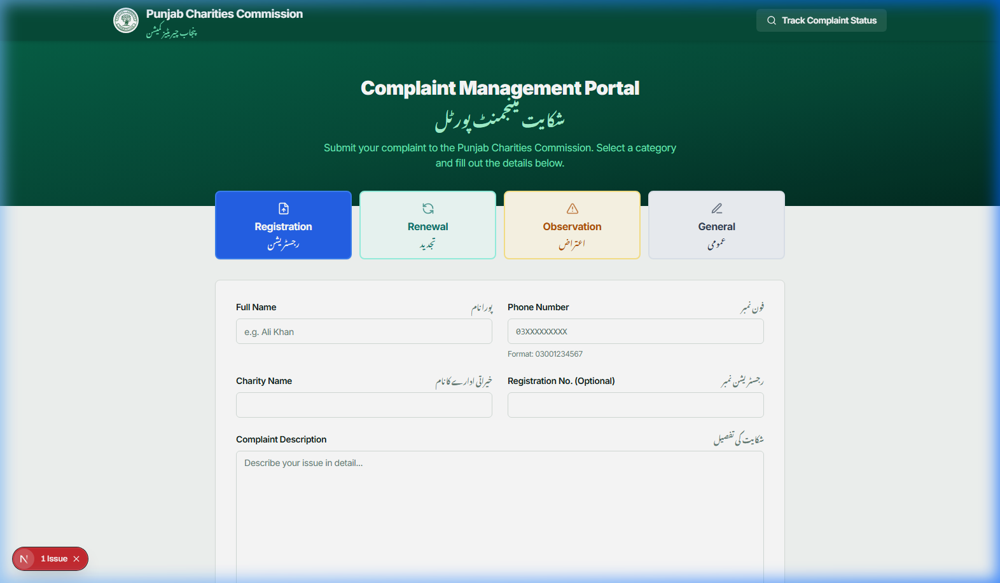
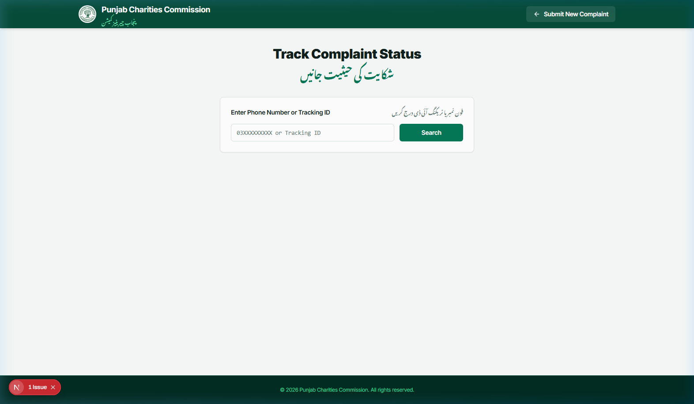
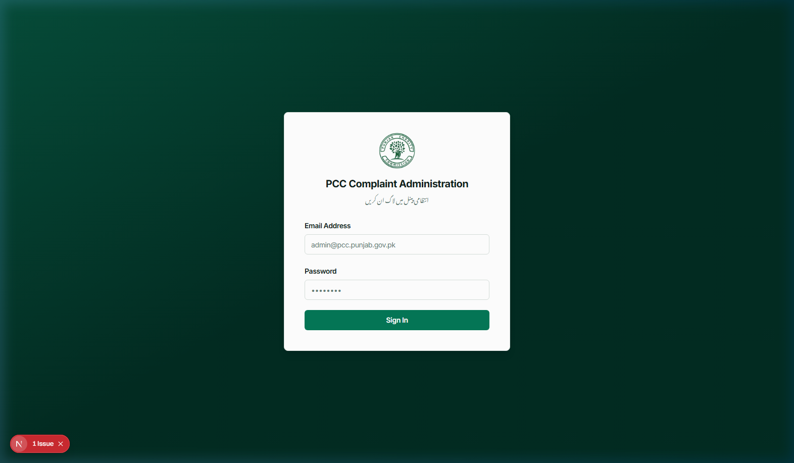

# PCC Complaint Management Portal — Usage Instructions

## Table of Contents

1. [For Complainants (Public Users)](#1-for-complainants-public-users)
   - [Submitting a Complaint](#11-submitting-a-complaint)
   - [Attaching Images](#12-attaching-images)
   - [Recording a Voice Message](#13-recording-a-voice-message)
   - [Tracking Your Complaint](#14-tracking-your-complaint)
2. [For Administrators](#2-for-administrators)
   - [Logging In](#21-logging-in)
   - [Viewing Complaints](#22-viewing-complaints-dashboard)
   - [Searching and Filtering](#23-searching-and-filtering)
   - [Reviewing a Complaint](#24-reviewing-a-complaint)
   - [Sending an Official Response](#25-sending-an-official-response)
   - [Deleting Complaints](#26-deleting-complaints)
3. [For Super Admins](#3-for-super-admins)
   - [Managing Admin Users](#31-managing-admin-users)
   - [Bulk Deletion](#32-bulk-deletion)
4. [Admin Roles Reference](#4-admin-roles-reference)

---

## 1. For Complainants (Public Users)

### 1.1 Submitting a Complaint

1. Open the portal URL in your browser.
2. You will see the **Complaint Management Portal** home page.

3. **Select a Category** by clicking one of the four tabs:
   - **Registration** (رجسٹریشن) — Issues related to registration of charities
   - **Renewal** (تجدید) — Issues related to renewal process
   - **Observation** (اعتراض) — Observations or objections raised
   - **General** (عمومی) — All other general complaints

4. **Fill in the form fields:**
   - **Full Name** — Your complete name
   - **Phone Number** — Must be in format `03XXXXXXXXX` (11 digits starting with 03)
   - **Charity Name** — Name of the charity organization
   - **Registration No.** — (Optional) The charity's registration number
   - **Complaint Description** — Describe your issue in detail

5. Optionally attach images or record a voice message (see sections below).

6. Click **Submit Complaint**.

7. On success, you will receive a **Tracking ID** (a UUID). **Save this ID** — you will need it to check your complaint status later. You can also use your phone number to track.

> **Important:** You can only have one pending complaint at a time per phone number. You must wait for a response before submitting another.

---

### 1.2 Attaching Images

Below the complaint description, you will find an **Attachments** section.

1. Click **Attach Images (0/3)** to open the file picker.
2. Select one or more images (JPG, PNG, or WEBP format).
3. Selected images appear as thumbnail previews.
4. To remove an image, click the red **X** button on the thumbnail.
5. Click **Attach Images** again to add more (up to 3 total).

**Limits:**
- Maximum **3 images** per complaint
- Maximum **5 MB** per image
- Accepted formats: JPG, PNG, WEBP

---

### 1.3 Recording a Voice Message

Below the image attachments, you will find the **Voice Recording** option.

1. Click **Record Voice Message (Max 2 min)**.
2. Your browser will ask for microphone permission — click **Allow**.
3. A red recording indicator will appear with a timer.
4. Speak your message.
5. Click **Stop** when finished (or it will auto-stop at 2 minutes).
6. A playback bar will appear — listen to your recording.
7. If you are not satisfied, click the **trash icon** to discard and re-record.

> **Tip:** This is useful for complainants who have difficulty typing. They can describe their issue verbally.

---

### 1.4 Tracking Your Complaint

1. Click **Track Complaint Status** in the header, or navigate to the tracking page.

2. Enter your **Tracking ID** (UUID) or your **Phone Number** (03XXXXXXXXX).
3. Click **Search**.
4. You will see:
   - **Status**: Pending / Replied / Resolved
   - **Category** and **Charity Name**
   - **Attachments** (if any — clickable image thumbnails)
   - **Voice Message** (if any — audio player)
   - **Official Response** (if the admin has replied)

---

## 2. For Administrators

### 2.1 Logging In

1. Navigate to the admin login page (append `/admin/login` to the portal URL).

2. Enter your **Email Address** and **Password**.
3. Click **Sign In**.
4. You will be redirected to the **Complaint Management** dashboard.

---

### 2.2 Viewing Complaints (Dashboard)

After logging in, you will see the **Complaint Management** dashboard:

- **Statistics Cards** at the top show: Total, Pending, Replied, and Resolved complaint counts.
- Below the stats is the **complaints table** showing all complaints assigned to your department.
- Each row shows: Charity Name, Complainant Name, Category, Status, Submitted Date, and action buttons.

> **Note:** Category admins (Registration, Renewal, Observation, General) can only see complaints in their own department. Super Admins see all complaints across all departments.

---

### 2.3 Searching and Filtering

- **Search**: Type in the search bar to filter complaints by charity name, complainant name, or phone number.
- **Category Filter**: Use the dropdown filter to show complaints from a specific category (All, Registration, Renewal, Observation, General).

---

### 2.4 Reviewing a Complaint

1. Click **Review & Respond** on any complaint row.
2. You will see the **Complaint Details** page with:
   - **Complainant Information** — Name, phone, charity name, registration number
   - **Submission Info** — Category and submission date
   - **Complaint Description** — The full text of the complaint
   - **Image Attachments** — Thumbnail grid of attached images (click to view full size in a new tab)
   - **Voice Recording** — Audio player to listen to the voice message

---

### 2.5 Sending an Official Response

1. On the complaint detail page, scroll down to the **Official Response** section.
2. Select a **Status**:
   - **Replied** — You have provided a response but the matter is not fully resolved
   - **Resolved** — The matter is completely resolved
3. Type your response in the text area.
4. Click **Send Response**.
5. The complainant can see your response when they track their complaint.

> **Note:** You can update the response later by revisiting the complaint and modifying the text and status.

---

### 2.6 Deleting Complaints

**Single deletion:**
1. On the dashboard, click the **trash icon** on any complaint row.
2. Confirm the deletion in the popup dialog.

> **Important:** Deleting a complaint will also permanently remove all associated images and voice recordings from storage. This action cannot be undone.

---

## 3. For Super Admins

Super Admins have all the same capabilities as category admins, plus:

### 3.1 Managing Admin Users

1. In the admin sidebar, click **Manage Admins**.
2. You will see the list of all admin users with their roles.

**Adding a new admin:**
1. Click **Add Admin**.
2. Enter the email address and password for the new admin.
3. Select a **Role**:
   - **Registration Admin** — Can only view/respond to Registration complaints
   - **Renewal Admin** — Can only view/respond to Renewal complaints
   - **Observation Admin** — Can only view/respond to Observation complaints
   - **General Admin** — Can only view/respond to General complaints
   - **Super Admin** — Full access to all departments + user management
4. Click **Create User**.

**Deleting an admin:**
1. Click the **Delete** button next to any admin user.
2. Confirm the deletion.

> **Note:** You cannot delete your own account.

---

### 3.2 Bulk Deletion

1. On the dashboard, use the **checkboxes** on the left side of each complaint row to select multiple complaints.
2. Click the **Delete Selected** button that appears at the top.
3. Confirm the bulk deletion.

> **Important:** Bulk deletion also removes all associated images and voice recordings from storage.

---

## 4. Admin Roles Reference

| Role | Dashboard Access | Responds To | Manage Users |
|------|-----------------|-------------|--------------|
| Registration Admin | Registration complaints only | Registration | No |
| Renewal Admin | Renewal complaints only | Renewal | No |
| Observation Admin | Observation complaints only | Observation | No |
| General Admin | General complaints only | General | No |
| Super Admin | All complaints, all departments | All categories | Yes |

---

**Portal Contact Information:**
- Email: contact@charitycommission.punjab.gov.pk
- Landline: 042-35713585
- WhatsApp: 0313-4995564
- Address: Punjab Charities Commission, Home Department, Punjab Civil Secretariat
